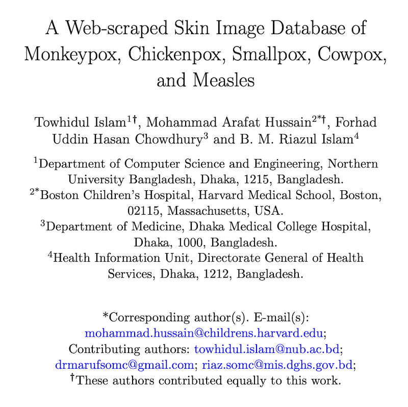

# Review of Monkeypox Machine Learning datasets and papers

Quick review of [arXiv:2206.01862v1](https://arxiv.org/abs/2206.01862) pre-print paper together with other related papers and datasets.

  Also available at: <a href="https://carlosvega.github.io/DebunkMonkeypoxML/">https://carlosvega.github.io/DebunkMonkeypoxML/</a>

# Abstract

During the COVID-19 pandemic, several researchers rushed to develop solutions for the diagnosis of COVID-19 by employing X-Ray images. 
The solutions and datasets developed during the initial stages of the pandemic broke all the rules and guidelines regarding ethical data science and proper scientific methodology.
Months later, several works were published criticizing and highlighting the pitfalls and mistakes committed during the pandemic.

Example works include:
- [Roberts, M., Driggs, D., Thorpe, M., Gilbey, J., Yeung, M., Ursprung, S., ... & Schönlieb, C. B. (2021). Common pitfalls and recommendations for using machine learning to detect and prognosticate for COVID-19 using chest radiographs and CT scans. Nature Machine Intelligence, 3(3), 199-217.](https://www.nature.com/articles/s42256-021-00307-0)
- [Santa Cruz, B. G., Bossa, M. N., Sölter, J., & Husch, A. D. (2021). Public covid-19 x-ray datasets and their impact on model bias–a systematic review of a significant problem. Medical image analysis, 74, 102225.](https://www.sciencedirect.com/science/article/pii/S136184152100270X)

With the raise of cases of monkeypox, several researchers were afraid that the same mistakes would be made again.
One of the first publications available in Google Scholar and arXiv includes the paper reviewed in this repository. 
Published in arXiv under the identifier [arXiv:2206.01862v1](https://arxiv.org/abs/2206.01862) in June 2022.

In the remaining of this document I present a methodological review showing the risks and mispractices put into practice in the aforementioned pre-print. I provide an experiment proposal as a proof of the points I try to make during this small review. Finally, I describe the impact of this pre-print, which has recently affected peer-reviewed publications.

# 1 Introduction

The pre-print paper published in arXiv aims to identify Monkeypox patients with an accuracy of ~97%. The motivation of the paper is clear. To diagnose monkeypox employing images. However, there are several concerns regarding whether the provided dataset and the ML solution help to achieve this goal. 

The researchers from the University of Oklahoma present two "studies":

- Study one: Aims to classify between Monkeypox and Chickenpox.
- Study two: Aims to classify between Monkeypox and others.

The paper indicates that "healthcare professionals can easily adapt our model as it is cost and time effective and does not require extensive PCR or microscopy testing. As an effect, our proposed model provides an opportunity to test in real-time screening of the patients with Monkeypox symptoms.". 

We believe the authors did not assess whether the model was actually modelling the diseases and not just distinguishing between data sources. This was a concern in [several COVID-19 solutions](https://doi.org/10.1016/j.inffus.2021.04.008).

This review hypothesizes that the trained classifier is not learning to identify the diseases but rather, to separate the two sets of images. Therefore, it is not learning the phenomena or any feature regarding the diseases.
To test this hypothesis, the dataset was "blinded" by adding rectangles over the regions of interest in the images, which are presumed to be the blisters, pustules and rash areas.

## Versioning lock

Just in case the versions of the paper and repository change or further versions are released, I note down here the versions this repository refers to.

- The reviewed version of the dataset was [the following](https://github.com/mahsan2/Monkeypox-dataset-2022/tree/18145e9feee4993d2bab83430b583a3e981398e4). 
- The version of the paper was [the following (2206.01862v1)](https://arxiv.org/abs/2206.01862v1). 
- The version of the dataset abstract was [the following (2206.01774v1)](https://arxiv.org/abs/2206.01774v1). 

# 2 Methodological issues

The pre-print presents a number of methodological issues.

- The authors did not share the code but shared enough details to somewhat replicate the results. 
- The authors did share the [dataset employed](https://github.com/mahsan2/Monkeypox-dataset-2022) which available in [GitHub](https://github.com/mahsan2/Monkeypox-dataset-2022).
- The authors provide a poorly collected dataset (from Google) with samples from Monkeypox, Chickenpox, Measles and Normal.
- The images provided have not been reviewed or curated by medical experts on the area.
- Class imbalance and data augmentation seem not properly handled.

## Data acquisition

The authors did not utilize any medical dataset. Rather, they collected samples from Google, purposely selecting images with commercial rights.
In consequence, the dataset contains images from Getty Images, Shutterstock, Dreamstime and other stock image repositories.
The images lack any coherence regarding the framed view, modality or body parts photographed.

The employed dataset would be enough reason to reject or discard the paper.

Still, the authors, which have published other research works before, state: 

>"We hope our publicly available dataset will play an important role and provide the opportunity to the ML researcher who cannot develop an AI-based model and conduct the experiment due to data scarcity."

The article states that the model's predictions were cross-checked by doctors. However, the authors did not describe the process. Was this a double-blinded process? How was this assessed? How could the images collected from the internet validated? This is an important part of the paper that is completely missed. Since this is a pre-print, we may expect future versions to include further details.

### Licensing in google search and stock image repositories

The paper mentions that the images were collected using google’s "free to use even for commercial purpose”. The dataset contains licensed images from several repositories such as Getty Images and Dreamstime (among others). Moreover, the first figure of the article shows that “Commercial & other licenses” was selected to collect the images. It is always good practice to state the origin of the images, not just how they were collected. 

An example of an image used in the dataset: https://www.gettyimages.com/detail/news-photo/chickenpox-4-year-old-child-1st-day-news-photo/179798100 . Below I include the meaning of "Commercial or other licenses" by Google and the licensing statements from some image repositories.

**Regardless of the licensing issues, images from stock repositories are not a reliable source of medically validated images. Specially if the work seeks to diagnose monkeypox employing such images.**

> Google: Commercial or other licenses: These images have non-Creative Commons licenses and can be from either sites available at no charge or commercial sites that require payment. https://support.google.com/websearch/answer/29508?

> Dreamstime: Conditional upon your compliance with this Agreement, Dreamstime grants you a limited license to download Watermarked Media solely for evaluating/comping whether you wish to purchase a license to the Non-Watermarked Media according to the Standard Terms and Conditions applicable to your use. You may not use a Watermarked Media in any final materials distributed within your company or any materials distributed outside your company or to the public or in any online or other electronic distribution system. https://www.dreamstime.com/terms#using

> Getty Images: Using images for free. The images on Getty Images are intended for use in commercial and editorial projects. This means you need to buy a license to use the image in most projects, including personal use. You can use an image without paying for a license with our Embed feature, which lets you use over 70 million photos on any non-commercial website or blog (if you're using it to sell a product, raise money or promote or endorse something, Embed isn't for you). Just do a search, then go to Filters to turn on the Embeddable images filter on the search results page. https://www.gettyimages.com/faq/working-files

## Risk of bias and method issues

The authors do not state the risks of their approach, which are extensively discussed in the literature. To put one example, cited reference [19](https://doi.org/10.1016/j.compbiomed.2020.103795) is shared to support the idea that ML can be used to diagnose diseases referred to as the use of ML in COVID-19. However, the same paper states that the "performance of the proposed CAD system was not compared with radiologists." and "few patients with COVID-19 may have negative RT-PCR results. Therefore, these patients may have been incorrectly excluded from the present study." 

Moreover, many reviews cite such paper as a poor example.
- "All proposed models suffer from a high or unclear risk of bias in at least one domain." https://www.nature.com/articles/s42256-021-00307-0 
- "This review indicates that almost all published prediction models are poorly reported and at high risk of bias such that their reported predictive performance is probably optimistic.” https://www.bmj.com/content/369/bmj.m1328.long

## Data augmentation

The paper does not clarify whether the data augmentation was done in a way that prevents data leakage of augmented instances into the valid set. Often, data augmentation is just a middle step in the code, but the augmented images are not preserved or shared to avoid misuse of them. If done wrongly, data augmentation can lead to data leakage (e.g. if they are mixed across test and train sets). Reading the paper, I could not see how data was managed or split (e.g. group-wise split to prevent breaking the i.i.d assumption). This is also known as row-wise leakage. This is one of the reasons that motivated me to contact the authors and see whether the code was available. I have not found it and the authors did not provide it.

## Class imbalance

The authors acknowledge the class imbalance but do not re-balance the dataset in any way, for instance, augmenting just the imbalanced classes. They do not mention any other measure to tackle the imbalance.

## External Validation

The authors do not provide any external validation. Their valid set consists of a split of images from the same dataset, which has the same generative process. A tool aimed to conduct clinical diagnosis should be thoroughly evaluated against different external datasets to increase the confidence on the model. Otherwise, chances are, we are just building a classifier to fit a dataset.

# 3 Review

**Disclaimer**: This review purposely avoids fixing the class imbalance issues to resemble the original work.

The images were "blinded" by adding rectangles over the regions of interest of the images, which are presumed to be the blisters, pustules and rash areas. See examples below:

## Methods

Given that this is a quick review, we employed FastAI v2, using a pre-trained VGG16 with batch normalization.

- Jupyter Notebook for study one [can be found here](https://github.com/carlosvega/DebunkMonkeypoxML/blob/main/monkeypox-study-one.ipynb)
- Jupyter Notebook for study two [can be found here](https://github.com/carlosvega/DebunkMonkeypoxML/blob/main/monkeypox-study-two.ipynb)

### Versions of employed software

- fastai 2.7.8
- tensorflow 2.5.0

## Results

The resulting model can classify the elements between the two folders in both "studies" even though the relevant areas of the images have been "blinded". Therefore, the model built by the authors is not properly modelling the phenomena they try to model, therefore it is not suited for clinical diagnosis, neither the dataset is recommendable for any research on medical machine learning.

## Remarks

**In short, researchers seem to believe that naming two folders chickenpox and monkeypox and training a classifier with whatever the content is can be enough to build a solution that actually distinguishes between chickenpox and monkeypox.**

- The fact that there is no public monkeypox dataset does not excuse using poor images. A study of proper data acquisition workflow must be conducted to acquire and verify monkeypox, measles and chickenpox images in humans. The images lack any coherence or curation. A bad dataset may be worse than no dataset. If data is not available, this does not excuse building a bad dataset. The shared dataset lacks medical relevance, which was disappointing given the goals stated in the article.

- Images tagged in stock image repositories are not necessarily medically validated. They can show similar pathologies but without actually corresponding to real cases.

- There are medical datasets of chickenpox images and other diseases, why was the same approach followed with other diseases?

- The paper states "dataset containing Monkeypox infected patients". Are any of the provided images from real patients? If so, did they consent to provide the images to the University of Oklahoma? Was the diagnosis actually corroborated through any other test?

Fortunately, the authors' paper has not been published in any scientific journal or conference proceedings yet. However, it is now common to cite and reference papers published in publication repositories, pre-print servers and other non-reviewed publication services. It is important to remain skeptical and careful with non-reviewed publications (and even with peer-reviewed publications). Their dataset remains open and available for the potential misuse of the research community.

# 4 Impact of the authors' work

The paper at issue has more than 1000 reads in ResearchGate (See [1](https://www.researchgate.net/publication/361134895_Monkeypox_Image_Data_collection), [2](https://www.researchgate.net/publication/361135721_Image_Data_collection_and_implementation_of_deep_learning-based_model_in_detecting_Monkeypox_disease_using_modified_VGG16)) and several recommendations. The little abstract about the dataset has a similar amount of reads and recommendations. The problem of poor science is that it can reach many people and serve as an example. Limitations and risks of the methods employed are not thoroughly discussed.

## Precedents

A similar [repository](https://github.com/ieee8023/covid-chestxray-dataset) created by Dr Joseph Cohen (though with better quality) was built to gather images of X-Ray scans of COVID-19 patients. This repository suffered from several issues and let to ML solutions that were critically evaluated in some publications. The image below presents an approach similar to the one followed in our experiment that showcased the weaknesses of several ML solutions developed with X-ray scans of COVID-19 patients.

- https://arxiv.org/abs/2004.12823
- https://arxiv.org/abs/2004.05405

The authors take the example of Dr Joseph Cohen and the Covid-19 image data collection. However, the authors do not mention the number of papers and literature criticizing the approach of Dr. Cohen (concerns included poor labeling, incoherence, bias, data acquisition variety, patient consent, etc.) and solutions developed with it. Dr Cohen included the following note in the repository: "please do not claim diagnostic performance of a model without a clinical study! This is not a Kaggle competition dataset." Additionally, Dr Cohen has dedicated several efforts to study the issues and avoiding the problems reported in the literature.

Still, the project of Dr Cohen was approved by an ethics committee, unlike the repository presented by researchers from the University of Oklahoma. Dr Cohen also provided a [research protocol](https://docs.google.com/document/d/14b7cou98YhYcJ2jwOKznChtn5y6-mi9bgjeFv2DxOt0/edit) for the collection of the images, extracting images from publications or submissions from physicians and researchers. It would be advisable to have a similar protocol in potential datasets of monkeypox images.

## Similar works

A number of similar works can be found following the same approach. For instance, the BiorXiv preprint "[A Web-scraped Skin Image Database of Monkeypox, Chickenpox, Smallpox, Cowpox, and Measles](https://doi.org/10.1101/2022.08.01.502199)". In this case, one of the authors is affiliated with Boston Children's Hospital, Harvard Medical School. This made me wonder whether the diagnosis relevance of the images was validated by medical doctors? After further enquiries, this author clarified that he was personally helping some of the other authors and that they mistakenly included his affiliation on the pre-print manuscript without his consent.

The authors published a Kaggle dataset. The dataset was taken down after contacting the authors with further interest on the validity of their dataset. https://www.kaggle.com/datasets/arafathussain/monkeypox-skin-image-dataset-2022

It is also odd to find that most of the cited examples (7 references out of 18) are from the second author. 

### Issues

Again, this paper shares similar issues such as:

- Risk of developing biased solutions. 
- The dataset shares data augmented images. Fortunately the information (filenames) enables making group-wise split to prevent this issue, but the paper should warn against these issues.
- The images lack coherence regarding the point of view. Some of them are close up images from the skin, other include hands, mouths, faces etc. 
- Last, the paper claims that "An ML or DL model, trained on our dataset, can help in the clinical diagnosis of Monkeypox.”. However, proofs on these regards for the given dataset are not provided. 

## Reaching peer-reviewed journals

In October 2022, Springer Journal of Medical Systems published the article "Monkeypox virus detection using pre-trained deep learning-based approaches" which employs the aforementioned dataset, stating that "More recently, Ahsan et al. [19] collected the images of Monkeypox, Chickenpox, Measles and Normal categories using web mining techniques and verified by the experts". There is no proof of any verification by experts of this web-scrapped dataset. The authors also state that "These encouraging results, which outperform the state-of-the-art methods, suggest that the proposed approach is applicable to health practitioners for mass screening". However they have not validated the performance of their solutions in real settings.

> Sitaula, C., & Shahi, T. B. (2022). Monkeypox virus detection using pre-trained deep learning-based approaches. Journal of Medical Systems, 46(11), 1-9. https://doi.org/10.1007/s10916-022-01868-2

